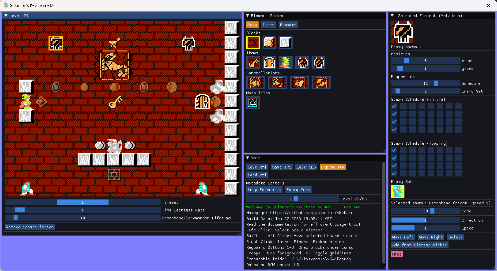

  # Solomon's Keychain - An editor for Solomon's Key (NES)

Welcome to the Solomon's Keychain code repository and release page. The editor is currently in development, and the first release is expected by February 2023. The code is standard C++20, and the project files were created using Microsoft Visual Studio Community 2022. You can compile the application from source, or get the latest precompiled win-x64 distribution under the [repository releases](https://github.com/kaimitai/skchain/releases/) once we ship. \
Make sure to read the included documentation (readme.html in the docs folder) for a detailed overview.
  

### Editor Capabilities
The editor allows you to alter level data: Block layout, level enemies and items, as well as level metadata. Both the US, EU and JP-versions of the ROM are supported. In addition we support editing game metadata; Demon Mirror enemy drop sets and schedules.
  

###### The editor will show level and game metadata information
  
The editor can save the edited levels as a patched ROM file (NES), or as a patch file (IPS). We also support our own xml format - which allows users to more easily compare file versions, use version control systems to track file history, and collaborate on level pack projects. One xml file will hold metadata changes, and the rest will represent each individual level.
  

### Comprehensive configuration xml
The editor is in large parts defined by an external configuration xml. The default xml should be suitable for most users, but the config xml makes it possible to define the editor's graphics, element picker layout, element descriptions and more.
  

### ROM map
The [ROM map document](./docs/solomon's_key_rom_map.md) contains all information I have gathered about the Solomon's Key ROM.

### Development Roadmap
* Support saving NES-file using a different ROM mapper, to make space for more items/enemies in the ROM than the original developers had available (SKEdit-compatibility)
* Automatically deduce the region of the loaded ROM file, and use the corresponsing configuration

### Version History

2022-01-24: Released v0.1
